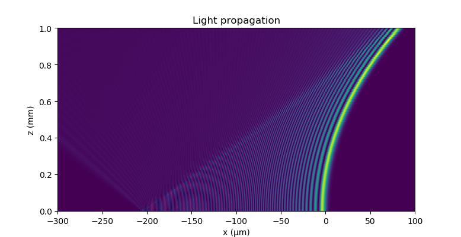

Examples
========

Main examples
-------------

:ref:`code_examples` code.

List of examples from the beampy.examples module.

.. automodule:: beampy.examples
   :members:
   :undoc-members:
   :show-inheritance:

   Gaussian beam width definition

   Waveguide profil definition

   Array of waveguides array, curved waveguides and arbitrary waveguides

.. figure:: results/free_propagation.png
   :alt: Free propagation

   Free propagation

   Multimodal beam splitter 1x2

   Benchmark attempt on the critical power needed to create a soliton in a Kerr
   medium. The found power is 15% smaller than the theorical value

   Grid definition

Other examples & results
------------------------

.. figure:: results/two_waveguides_power.png
   :alt: two waveguides power

   Power in two waveguides

.. figure:: results/waveguide_array_power.png
   :alt: waveguide array power

   Power over z in each waveguide of the array. The power distribution in a
   waveguide array follow the Bessel function.

   
   Airy beam propagation
